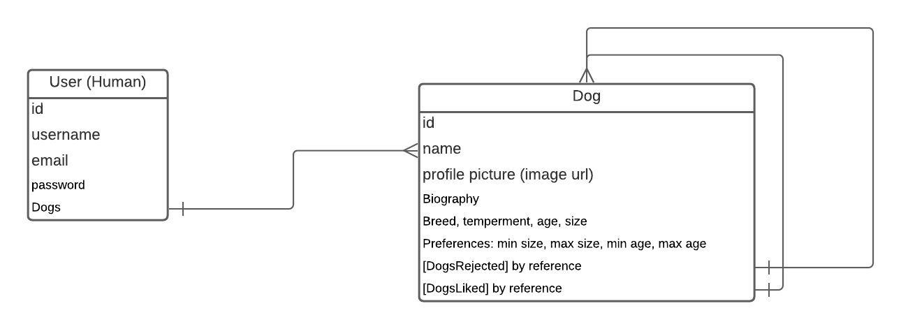

# Team-2-Project
## Fetch

### Routes:

| Verb | Endpoint | Action |
| ----------- | ----------- | ----------- |
| GET | '/' | Home page |
| GET | '/auth/signin' | Signin page |
| POST | '/auth/signin' | Signin page post route |
| GET | '/auth/signup' | Signup page |
| POST | '/auth/signup' | Signup page |
| GET | '/profile' | View your own profile |
| PUT | '/profile' | Update your own profile |
| DELETE | '/profile' | Delete your own profile |
| POST | '/profile' | Create your own profile |
| GET | '/profile/new' | Form to create a new dog on your own profile |
| GET | '/profile/:dogid' | View data on one of your dogs |
| POST | '/profile/:dogid' | Create one of your dog's profile |
| PUT | '/profile/:dogid' | Update one of your dog's profiles |
| DELETE | '/profile/:dogid' | Delete one of your dog's profile |
| PUT | '/profile/:dogid/add' | Add a dog2 your dogs likes (this one I'm not sure about) |
| GET | '/profile/:dogid/matches' | View your dog's matches |
| GET | '/profile/:dogid/dogs' | View other dogs (random from database based on criteria) |

### ODM: 

Link to ODM on Lucid Chart:

https://lucid.app/lucidchart/46ce42b4-8d28-4635-8980-9d130cf57498/edit?page=0_0#
